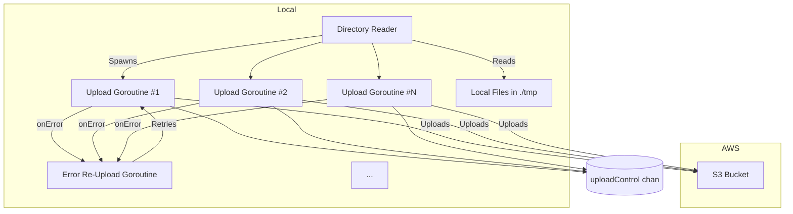

## 📘 Concurrent File Uploads to AWS S3 in Go

This example demonstrates how to **upload files concurrently** to an AWS S3 bucket using Go's built-in support for **goroutines** and **channels**.

### 🧠 Key Concepts Covered

- **Goroutines**: Lightweight threads managed by the Go runtime.
- **Channels**: Used for synchronizing and communicating between goroutines.
- **WaitGroup**: Waits for a collection of goroutines to finish.
- **AWS SDK for Go**: Used to interact with S3.

---

### 🗂️ Program Overview

1. **S3 Client Initialization**
   - AWS session and credentials are configured in `init()`.
   - `s3Client` becomes a global instance used across goroutines.

2. **Directory Scanning**
   - Files are read one at a time from the `./tmp` directory.

3. **Concurrency Control**
   - `uploadControl` channel limits the number of concurrent uploads (buffered to 100).
   - `errorFileUpload` channel handles re-uploads if an error occurs.

4. **Upload Worker**
   - Each file is uploaded in its own goroutine.
   - If upload fails, the filename is pushed back to the `errorFileUpload` channel for retry.

---

### 📌 Channels Used

| Channel Name        | Type                    | Purpose                                     |
|---------------------|-------------------------|---------------------------------------------|
| `uploadControl`     | `chan struct{}`         | Limits concurrency to 100 goroutines        |
| `errorFileUpload`   | `chan string`           | Collects filenames that failed to upload    |

---

### 🕸️ System Diagram

---

### 🔁 Error Handling Strategy

If a file fails to upload:
- The filename is sent to `errorFileUpload`.
- A goroutine running in the background waits for errors and retries uploads by spawning new workers.

---

### 🧵 Multithreading & Concurrency Explained

- **Goroutines** handle file uploads in parallel without blocking the main thread.
- **`uploadControl`** acts as a **semaphore** to cap concurrent uploads (prevents overwhelming the network or AWS).
- **`sync.WaitGroup`** ensures the program waits for all uploads to complete before exiting.
- **Error recovery** is automatic—files that fail are retried via a dedicated retry loop.
