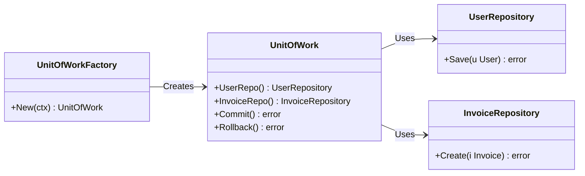
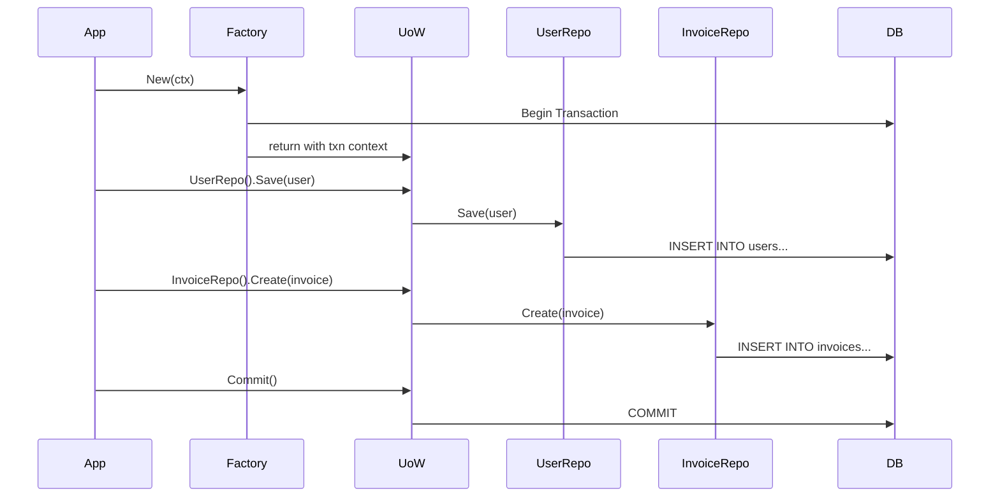

## 🧱 Concept Overview

In Go, the **Unit of Work** pattern coordinates **multiple repository actions** under a single transaction. It's especially helpful when you're writing to multiple tables and want **atomicity** (i.e., all succeed or all fail).

---

## 🗂️ Example Domain: User + Invoice

Suppose we want to:

- Create a user
- Create an initial invoice
- All in a **single transaction**, either in **PostgreSQL** or **MySQL**

---

## 🧩 Components

- `UserRepository`
- `InvoiceRepository`
- `UnitOfWork` — starts and commits/rolls back the transaction
- `UnitOfWorkFactory` — builds a `UnitOfWork` depending on which DB we're using

---

## 1️⃣ Component Diagram (Interface-based UoW Pattern)



---

## 2️⃣ Package/Component Diagram (Runtime Delegation)

```mermaid
graph TD
    A[App Service Layer] -->|calls| B[UnitOfWorkFactory]
    B -->|New()| C[UnitOfWork]

    C --> D[UserRepository]
    C --> E[InvoiceRepository]
    C -->|commit/rollback| F[(DB Transaction)]

    subgraph PostgreSQL
        D1[PostgresUserRepo]
        E1[PostgresInvoiceRepo]
    end

    subgraph MySQL
        D2[MySQLUserRepo]
        E2[MySQLInvoiceRepo]
    end

    D -->|impl| D1 & D2
    E -->|impl| E1 & E2

```

---

## 🧪 Optional Additions

Want to visualize transaction management?



---

## 🧰 Optional Interface Sketch (Go-style)

```go
type UnitOfWork interface {
    UserRepo() UserRepository
    InvoiceRepo() InvoiceRepository
    Commit() error
    Rollback() error
}

type UnitOfWorkFactory interface {
    New(ctx context.Context) (UnitOfWork, error)
}
```

Inside the DB-specific UoW:

```go
type mysqlUnitOfWork struct {
    tx *sql.Tx
    userRepo *MySQLUserRepository
    invoiceRepo *MySQLInvoiceRepository
}

func (u *mysqlUnitOfWork) UserRepo() UserRepository {
    return u.userRepo
}

// etc...
```