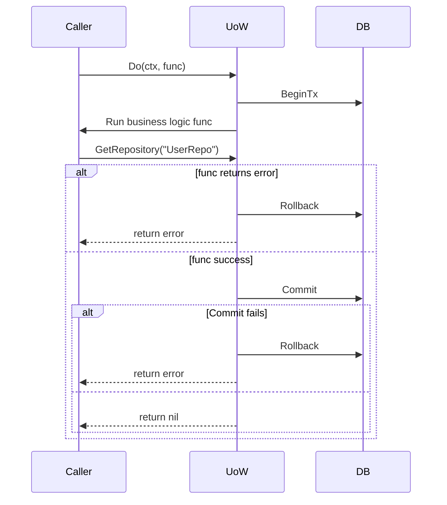

Excellent! This implementation captures the **core of the Unit of Work pattern** in Go quite well — dynamic repository registration, scoped transactions, rollback-on-failure, and separation of concerns. Let me walk through the **workflow**, **design intentions**, and how **interfaces** help in both current and extended use cases — with a pedantic slant, of course.

---

## 🧠 **What this implementation does (workflow overview)**

### Step-by-step breakdown of `Do(ctx, fn)`:

```text
1. Start a new transaction using `BeginTx`
2. Execute the business logic function `fc(uow)`
   - Repositories are fetched dynamically by name via `GetRepository(...)`
3. If `fc` returns error:
   - Roll back the transaction and return the error
4. If `fc` returns nil:
   - Try to commit
   - If commit fails, rollback and return that error
```

---

## 🧩 **Mermaid Diagram: Internal Workflow**



---

## ✅ **Where Interfaces Help You Right Now**

### 1. `UowInterface` itself is useful for:
- **Abstracting out your actual UoW implementation**: allows mocking or swapping in tests or for different databases.
- You could define mocks like:

```go
type FakeUow struct {
    CalledRepositories map[string]bool
    TxCommitted bool
    // etc...
}
```

Use this in unit tests for app/service layers.

---

### 2. `RepositoryFactory` returns `interface{}` — and this is where **stronger typing helps**

Right now, your factory returns `interface{}`. This is flexible, but not safe.

You **could** define generic interfaces like:

```go
type UserRepository interface {
    Save(ctx context.Context, user *User) error
}
```

And use type assertions after calling `GetRepository`:

```go
repo, _ := uow.GetRepository(ctx, "UserRepo")
userRepo := repo.(UserRepository) // panics if wrong
```

**Better yet?** Wrap `GetRepository[T any]()` using Go 1.18+ generics.

---

## 🔧 **Suggested Extension with Generics (safe type assertion)**

Here’s a generic helper:

```go
func GetTypedRepository[T any](ctx context.Context, uow UowInterface, name string) (T, error) {
    repo, err := uow.GetRepository(ctx, name)
    if err != nil {
        var zero T
        return zero, err
    }
    typed, ok := repo.(T)
    if !ok {
        var zero T
        return zero, fmt.Errorf("repository %s is not of expected type", name)
    }
    return typed, nil
}
```

Usage:

```go
userRepo, err := GetTypedRepository[UserRepository](ctx, uow, "UserRepo")
```

Now it's **safe, typed, and testable**.

---

## 🧪 Probable Use Cases Where This Pattern Shines

### 🧭 1. **Multi-tenant write routing**

Suppose some tenants write to MySQL and others to Postgres. Your `NewUow(ctx)` could delegate to the right DB based on `ctx`.

- The interface remains unchanged.
- The actual underlying `*sql.DB` differs.

### 🧠 2. **Mocking for tests**

Imagine testing a service that uses `UowInterface`. Your test can inject a fake:

```go
type MockUow struct {
    Repositories map[string]interface{}
}
func (m *MockUow) GetRepository(ctx context.Context, name string) (interface{}, error) {
    return m.Repositories[name], nil
}
```

### 🔁 3. **Support for multiple DB versions or schemas**

Say you're writing to PostgreSQL v12 in one region and v15 elsewhere — or have tables named differently (e.g., due to partitioning or legacy systems). You can register region-specific or version-specific repositories into the UoW.

---

## ✨ Optional Enhancements

1. **Middleware hook**: Logging UoW operations
2. **Repo lifecycle**: Cache per-transaction repositories so you don’t recreate them
3. **Traceability**: Add transaction IDs for observability/logging

---

## 💡 TL;DR Pedantic Summary

| Concern | This Impl | Suggested Improvements |
|--------|------------|------------------------|
| Transaction Scope | ✅ Clear and well-scoped via `Do()` | — |
| Repository Discovery | ✅ Dynamic via registry | Add **generic typing** for safety |
| Interface Abstraction | ✅ `UowInterface` | Extend with concrete `Repository` interfaces |
| Testability | ✅ Supports mocking | Add mockable typed UoW |
| DB Swapping | ✅ Supports multiple DBs if `NewUow()` is flexible | Consider config/context-based `UowFactory` |

---

Want a full example using this pattern with one real repository, and a service function that orchestrates multiple saves using the UoW?